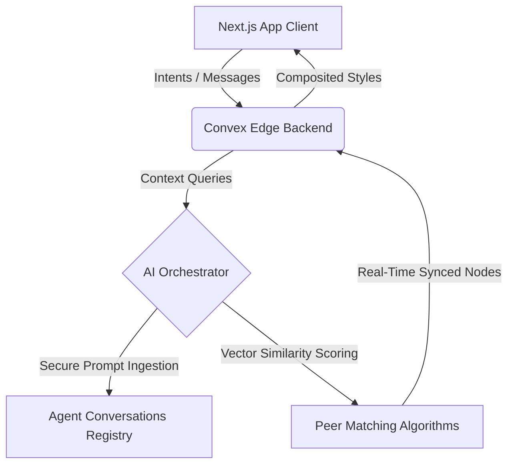

# <div align="center"><br/>SkillSwap OS</div>

<div align="center">
  <h3>The AI Career Operating System</h3>
  <p>An intelligent, real-time spatial computing canvas that maps professional intents, matches peer capabilities, automates autonomous workflows, and powers early-stage investor sourcing.</p>
</div>

<div align="center">

[](https://nextjs.org)
[](https://react.dev)
[](https://typescriptlang.org)
[](https://tailwindcss.com)
[](https://convex.dev)
[](https://framer.com/motion)
[](https://openai.com)
[](https://vercel.com)
[](LICENSE)

</div>

---

## 👁️ Vision & Market Fit

### The Paradigm Shift
Traditional career portfolios are archive-only files. LinkedIn acts as a social board; GitHub hosts code but lacks human synergy; standard platforms fail to facilitate real-time project collaboration.

**SkillSwap** changes the framework by building the first **AI Career Operating System**. By expressing intent in natural language, students register workspace nodes, request roadmap suggestions from AI agents, build projects, and unlock peer-to-peer collaboration loops.

### The Friction Points
* **Stagnant Profiles:** Static credentials fail to capture practical, real-time capability.
* **Collaboration Friction:** Discovering compatible builders for hackathons requires sorting through unstructured channels.
* **Isolated Learning:** General educational tutorials lack specialized guidance tailored to an individual's personal projects.

---

## ⚙️ Core Architecture & Flow



### 🧠 AI Routing & Safety Framework
* **Context Preservation Cache:** The AI agent fleet shares a unified `careerContext` (loaded securely on the backend) to prevent user context drift across chat screens.
* **Strict Prompt Validation:** Input values are stripped and checked for injection patterns to keep inference tasks secure.
* **Convex Edge Computing:** Minimizes network latency by executing scoring logic directly in edge database functions.

---

## 🛠️ Features

### 💻 Spatial Workspace (Nexus)
* **Omni-Prompt Intent Engine:** Paste or type intent descriptions (e.g. *"I want to build a SaaS"* or *"I can teach Python"*).
* **0 Re-renders Layout Canvas:** Physics-based coordinates translate into a node network updated directly via DOM refs to run at 60 FPS.

### 🤖 Autonomous Agent Fleet
* **Career Coach:** Provides career recommendations based on project logs.
* **Resume Reviewer:** Evaluates resume JSON files against FAANG standards.
* **Interview Coach:** Runs behavioral mock interviews using STAR analysis.
* **Learning Planner:** Designs week-by-week roadmaps.

### 💼 Investor Sourcing Mode
* **Builder Discovery:** Ranks builders dynamically using activity metrics.
* **Dealflow Bookmarking:** Allows bookmarked portfolios with custom notes.

---

## 📋 Technology Directory & Modules

| Technology | Purpose | Implementation details |
| :--- | :--- | :--- |
| **Next.js 16** | Frontend framework | App Router layouts and streaming routes. |
| **Convex 1.42** | Database & Edge functions | Live schema synchronization and secure queries. |
| **Groq / Llama 3** | Inference engine | In-context processing. |
| **Framer Motion** | Physics transitions | Custom layout animations and hover presets. |

---

## 🚦 Installation

### 1. Setup Local Repository
```bash
git clone https://github.com/sapnajha757/SkillSwap.git
cd skillswap
npm install
```

### 2. Environment Configuration
Create a `.env.local` file:
```env
NEXT_PUBLIC_CONVEX_URL=https://your-deployment.convex.cloud
GROQ_API_KEY=gsk_your_groq_api_key
```

### 3. Deploy Database Functions
```bash
npx convex dev
```

### 4. Start Local Server
```bash
npm run dev
```

---

## 🛡️ Security & Performance Standards

* **XSS & clickjacking Defenses:** Next.js compiler config enforces `X-Frame-Options: DENY` and nosniff policies.
* **IDOR Participant Validation:** Database actions (`respondToMatch`) verify user tokens against `teacherId`/`learnerId` participant values.
* **Keyboard Navigation accessibility:** Full command palette routing support (`⌘+K`) and ARIA-compliant screen reader targets.
